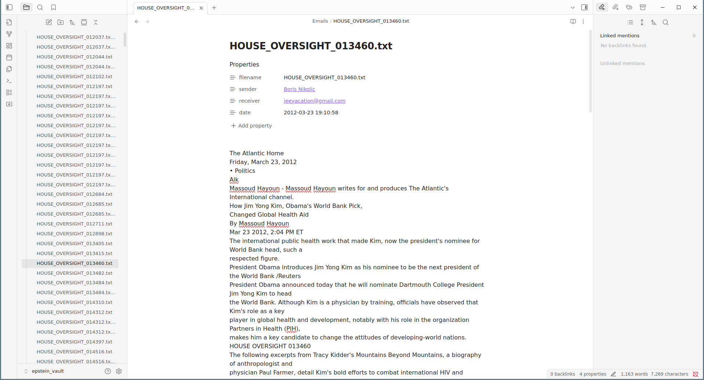

# Jeffrey Epstein Emails as an Obsidian Vault

The set of released emails of Jeffrey Epstein processed into an Obsidian Vault using the Obsidian Importer plugin an Claude Code.

The set of text files from the release has been processed by a Python program written by Claude Code. Some choices of heuristics in the name disambiguation are made by this code. This might cause issues. To verify the information provided in this vault, please go to the official release located [here](https://drive.google.com/drive/folders/1hTNH5woIRio578onLGElkTWofUSWRoH_).

